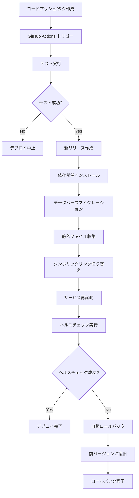

# ロールバック機能付きEC2デプロイガイド

このガイドでは、ロールバック機能付きの高度なデプロイシステムを使用して、DjangoアプリケーションをEC2サーバーにデプロイする手順を説明します。

## 🎯 システムの特徴

### 解決される問題
従来のデプロイシステムでは以下の問題がありました：
- **ロールバック不可**: 問題発生時の復旧が困難
- **バージョン管理なし**: デプロイ履歴の管理ができない
- **ダウンタイム**: デプロイ中のサービス停止
- **リスク管理**: デプロイ失敗時の対処が困難

### 新システムの特徴

#### バージョン管理
- **タグベースデプロイ**: Gitタグ（例：v1.0.0）を使用したバージョン管理
- **デプロイ履歴**: 過去のデプロイ履歴を保持（最大5リリース）
- **バージョン追跡**: 現在と前のバージョンを記録

#### ロールバック機能
- **ワンクリックロールバック**: GitHub Actionsから簡単実行
- **指定バージョンロールバック**: 特定バージョンへの復旧
- **自動ロールバック**: ヘルスチェック失敗時に自動実行

#### ゼロダウンタイムデプロイ
- **シンボリックリンク方式**: 新バージョン準備後に瞬時切り替え
- **共有リソース**: ログ、メディア、設定ファイルを共有
- **サービス継続**: デプロイ中もサービス稼働継続

#### ヘルスチェック機能
- **自動検証**: デプロイ後の健全性チェック
- **多角的チェック**: サービス、プロセス、HTTP、データベース、リソース確認
- **失敗時対応**: 自動ロールバック実行

## 前提条件

- Ubuntu 22.04 LTS のEC2インスタンス
- SSH接続可能な状態
- ドメイン名（オプション）

## 1. EC2インスタンスの初期設定

### 1.1 サーバーにSSH接続

```bash
ssh -i your-key.pem ubuntu@your-ec2-ip
```

### 1.2 初期設定スクリプトの実行

```bash
# リポジトリをクローン（一時的）
git clone https://github.com/YOUR_USERNAME/YOUR_REPOSITORY.git temp_repo
cd temp_repo

# 初期設定スクリプトを実行
chmod +x deploy/server_setup.sh
./deploy/server_setup.sh
```

### 1.3 SSH鍵の設定

スクリプト実行後に表示される公開鍵をコピーして、GitHubリポジトリの設定に追加します：

1. GitHubリポジトリページで `Settings` → `Deploy keys` に移動
2. `Add deploy key` をクリック
3. 表示された公開鍵を貼り付け
4. `Allow write access` にチェック（必要に応じて）
5. `Add key` をクリック

## 2. ロールバック対応システムのセットアップ

### 2.1 既存システムからの移行

既存のシンプルなデプロイシステムがある場合は、以下のコマンドで新システムに移行できます：

```bash
# セットアップスクリプトを実行
sudo bash /var/www/diary/deploy/setup-rollback-system.sh
```

このスクリプトは以下の処理を自動実行します：
- 既存システムのバックアップ作成
- 新しいディレクトリ構造の作成
- 設定ファイルとメディアファイルの移行
- デプロイスクリプトのコピー
- systemdサービスとNginx設定の更新

### 2.2 ディレクトリ構造

セットアップ後のディレクトリ構造：

```
/var/www/
├── releases/                    # リリース版保存ディレクトリ
│   ├── v1.0.0/                 # バージョン1.0.0
│   ├── v1.0.1/                 # バージョン1.0.1
│   └── develop-20250525-123456/   # developブランチのスナップショット
├── shared/                      # 共有ファイル
│   ├── .env                    # 環境設定ファイル
│   ├── logs/                   # ログファイル
│   ├── media/                  # メディアファイル
│   └── static/                 # 静的ファイル
├── scripts/                     # デプロイスクリプト
│   ├── deploy-with-rollback.sh # メインデプロイスクリプト
│   └── health-check.sh         # ヘルスチェックスクリプト
├── diary -> releases/v1.0.1/   # 現在のアプリケーション（シンボリックリンク）
├── current_version              # 現在のバージョン記録
├── previous_version             # 前のバージョン記録
└── deploy.log                   # デプロイログ
```

## 3. 環境変数の設定

### 3.1 .envファイルの編集

```bash
sudo -u www-data nano /var/www/shared/.env
```

以下の値を適切に設定してください：

```env
# Django設定
SECRET_KEY=your_very_secure_secret_key_here
DJANGO_SETTINGS_MODULE=config.settings_production

# データベース設定
POSTGRES_DB=diary_production
POSTGRES_USER=diary_user
POSTGRES_PASSWORD=your_secure_database_password
POSTGRES_HOST=localhost
POSTGRES_PORT=5432

# サーバー設定
DOMAIN_NAME=your-domain.com
SERVER_IP=your_ec2_public_ip

# HTTPS設定（SSL証明書使用時）
USE_HTTPS=False
```

### 3.2 PostgreSQLパスワードの更新

```bash
sudo -u postgres psql
ALTER USER diary_user WITH PASSWORD 'your_secure_database_password';
\q
```

## 4. デプロイの実行

### 4.1 developブランチへの自動デプロイ

developブランチにコードをpushすると、GitHub Actionsが自動的にデプロイを実行します：

```bash
# developブランチにpush
git checkout develop
git push origin develop
```

### 4.2 タグベースデプロイ（推奨）

```bash
# リリースタグを作成してプッシュ
git tag v1.0.0
git push origin v1.0.0
```

GitHub Actionsが自動的にデプロイを実行します。

### 4.2 手動デプロイ

```bash
bash /var/www/scripts/deploy-with-rollback.sh deploy v1.0.0 https://github.com/user/repo.git
```

### 4.3 GitHub Actionsでの手動デプロイ

1. GitHubリポジトリの「Actions」タブを開く
2. 「Deploy with Rollback Support」ワークフローを選択
3. 「Run workflow」をクリック
4. Action: `deploy`、Version: `v1.0.0` を入力して実行

## 5. ロールバック操作

### 5.1 GitHub Actionsでロールバック

1. 「Actions」タブから「Deploy with Rollback Support」を選択
2. 「Run workflow」をクリック
3. Action: `rollback`、Version: `v1.0.0`（省略可）を入力して実行

### 5.2 コマンドラインロールバック

```bash
# 前のバージョンにロールバック
bash /var/www/scripts/deploy-with-rollback.sh rollback

# 特定のバージョンにロールバック
bash /var/www/scripts/deploy-with-rollback.sh rollback v1.0.0
```

### 5.3 リリース管理

```bash
# デプロイ済みリリース一覧表示
bash /var/www/scripts/deploy-with-rollback.sh list

# ヘルスチェック実行
bash /var/www/scripts/health-check.sh
```

## 6. GitHub Actions の設定

### 6.1 GitHub Secrets の設定

GitHubリポジトリの `Settings` → `Secrets and variables` → `Actions` で以下のシークレットを追加：

- `EC2_HOST`: EC2インスタンスのパブリックIP
- `EC2_USERNAME`: `ubuntu`
- `EC2_SSH_KEY`: EC2接続用の秘密鍵の内容

### 6.2 ワークフローファイル

`.github/workflows/deploy.yml` を使用してください。このファイルには以下の機能が含まれています：

- developブランチへのpush時の自動デプロイ
- タグ作成時の自動デプロイ
- 手動デプロイとロールバック
- テスト実行
- ヘルスチェック
- 失敗時の自動ロールバック

## 7. ヘルスチェック機能

### 7.1 チェック項目

#### サービス・プロセス確認
- Gunicornサービスの状態
- Nginxサービスの状態
- プロセスの動作確認
- ポートのリッスン状態

#### アプリケーション確認
- データベース接続
- HTTPレスポンス（200 OK）
- ヘルスチェックエンドポイント

#### システムリソース確認
- ディスク使用量
- メモリ使用量
- エラーログの確認

### 7.2 ヘルスチェック実行

```bash
# 総合ヘルスチェック
bash /var/www/scripts/health-check.sh

# 個別チェック
bash /var/www/scripts/health-check.sh --services    # サービス状態のみ
bash /var/www/scripts/health-check.sh --http        # HTTPレスポンスのみ
bash /var/www/scripts/health-check.sh --database    # データベース接続のみ
bash /var/www/scripts/health-check.sh --resources   # システムリソースのみ
```

### 7.3 自動ヘルスチェック

デプロイ後、システムは自動的にヘルスチェックを実行します。失敗した場合は自動的に前のバージョンにロールバックされます。

## 8. SSL証明書の設定（オプション）

### 8.1 Let's Encryptを使用

```bash
# SSL証明書の取得
sudo certbot --nginx -d your-domain.com -d www.your-domain.com

# 自動更新の設定
sudo crontab -e
# 以下の行を追加
0 12 * * * /usr/bin/certbot renew --quiet
```

### 8.2 HTTPS設定の有効化

```bash
# .envファイルを編集
sudo -u www-data nano /var/www/shared/.env
```

`USE_HTTPS=True` に変更し、サービスを再起動：

```bash
sudo systemctl restart diary-gunicorn
sudo systemctl restart nginx
```

## 9. 運用・監視

### 9.1 ログの確認

```bash
# Gunicornログ
sudo journalctl -u diary-gunicorn -f

# Nginxエラーログ
sudo tail -f /var/log/nginx/diary_error.log

# Djangoアプリケーションログ
sudo tail -f /var/log/diary/django.log

# デプロイログ
sudo tail -f /var/www/deploy.log
```

### 9.2 サービスの状態確認

```bash
# サービス状態の確認
sudo systemctl status diary-gunicorn
sudo systemctl status nginx
sudo systemctl status postgresql

# サービスの再起動
sudo systemctl restart diary-gunicorn
sudo systemctl restart nginx
```

### 9.3 データベースのバックアップ

```bash
# バックアップの作成
sudo -u postgres pg_dump diary_production > backup_$(date +%Y%m%d_%H%M%S).sql

# 定期バックアップの設定（crontab）
sudo crontab -e
# 毎日午前2時にバックアップ
0 2 * * * sudo -u postgres pg_dump diary_production > /var/backups/diary_$(date +\%Y\%m\%d_\%H\%M\%S).sql
```

## 10. トラブルシューティング

### 10.1 よくある問題

#### 502 Bad Gateway エラー
- Gunicornサービスが起動していない
- `sudo systemctl start diary-gunicorn`

#### 静的ファイルが表示されない
- 静的ファイルの収集を実行
- `sudo -u www-data venv/bin/python manage.py collectstatic`

#### データベース接続エラー
- PostgreSQLサービスの確認
- `sudo systemctl status postgresql`
- 認証情報の確認

#### デプロイが失敗する場合
1. **ログの確認**
   ```bash
   tail -f /var/www/deploy.log
   journalctl -u diary-gunicorn -f
   ```

2. **ヘルスチェックの実行**
   ```bash
   bash /var/www/scripts/health-check.sh
   ```

3. **手動ロールバック**
   ```bash
   bash /var/www/scripts/deploy-with-rollback.sh rollback
   ```

### 10.2 設定ファイルの問題

1. **環境変数の確認**
   ```bash
   cat /var/www/shared/.env
   ```

2. **権限の確認**
   ```bash
   ls -la /var/www/
   ```

### 10.3 サービスの問題

1. **サービス状態の確認**
   ```bash
   systemctl status diary-gunicorn
   systemctl status nginx
   ```

2. **設定ファイルの確認**
   ```bash
   nginx -t
   ```

## 11. セキュリティ対策

### 11.1 定期的なアップデート

```bash
# システムアップデート
sudo apt update && sudo apt upgrade -y

# Pythonパッケージのアップデート
cd /var/www/diary  # 現在のリンク先
sudo -u www-data venv/bin/poetry update
```

### 11.2 ファイアウォール設定の確認

```bash
# UFW状態確認
sudo ufw status

# 必要に応じてルールを追加
sudo ufw allow from specific_ip to any port 22
```

## 12. デプロイワークフロー



## 13. 運用のベストプラクティス

### 13.1 デプロイ前の確認事項
- テストの実行と成功確認
- データベースマイグレーションの確認
- 設定ファイルの更新確認
- 依存関係の更新確認

### 13.2 デプロイ後の確認事項
- ヘルスチェックの結果確認
- ログの確認
- 主要機能の動作確認
- パフォーマンスの確認

### 13.3 定期メンテナンス
- 古いリリースの自動削除（最大5リリース保持）
- ログファイルのローテーション
- データベースバックアップの確認
- システムリソースの監視

## 14. システムの利点

### 運用面
- **リスク軽減**: 問題発生時の迅速な復旧
- **ダウンタイム削減**: ゼロダウンタイムデプロイ
- **運用効率**: 自動化されたデプロイとロールバック

### 開発面
- **安心感**: 失敗を恐れずにデプロイ可能
- **迅速な対応**: 問題発生時の素早い対処
- **バージョン管理**: 明確なリリース履歴

### 監視面
- **可視性**: デプロイ状況の明確な把握
- **ログ管理**: 詳細なデプロイログ
- **ヘルスモニタリング**: 継続的な健全性監視

このロールバック機能付きデプロイシステムにより、安全で効率的なDjangoアプリケーションの運用が可能になります。
