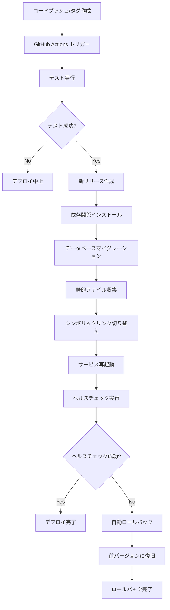

# ロールバック機能付きデプロイシステム

このドキュメントでは、新しく実装されたロールバック機能付きデプロイシステムについて説明します。

## 🎯 解決された問題

従来のデプロイシステムでは以下の問題がありました：

- **ロールバック不可**: 直接`git pull`でデプロイしているため、問題が発生した場合に前のバージョンに戻すのが困難
- **バージョン管理なし**: デプロイされたバージョンの履歴管理がない
- **ダウンタイム**: デプロイ中にサービスが停止する可能性
- **リスク管理**: デプロイ失敗時の対処が困難

## 🚀 新システムの特徴

### 1. バージョン管理
- **タグベースデプロイ**: Gitタグ（例：v1.0.0）を使用したバージョン管理
- **デプロイ履歴**: 過去のデプロイ履歴を保持（最大5リリース）
- **バージョン追跡**: 現在のバージョンと前のバージョンを記録

### 2. ロールバック機能
- **ワンクリックロールバック**: GitHub Actionsから簡単にロールバック実行
- **指定バージョンロールバック**: 特定のバージョンへの復旧が可能
- **自動ロールバック**: デプロイ後のヘルスチェック失敗時に自動実行

### 3. ゼロダウンタイムデプロイ
- **シンボリックリンク方式**: 新バージョンを準備してから瞬時に切り替え
- **共有リソース**: ログ、メディアファイル、設定ファイルを共有
- **サービス継続**: デプロイ中もサービスが継続稼働

### 4. ヘルスチェック機能
- **自動検証**: デプロイ後に自動でアプリケーションの健全性をチェック
- **多角的チェック**: サービス、プロセス、HTTP、データベース、リソースを確認
- **失敗時対応**: ヘルスチェック失敗時は自動でロールバック

## 📁 ディレクトリ構造

```
/var/www/
├── releases/                    # リリース版保存ディレクトリ
│   ├── v1.0.0/                 # バージョン1.0.0
│   ├── v1.0.1/                 # バージョン1.0.1
│   └── main-20250525-123456/   # mainブランチのスナップショット
├── shared/                      # 共有ファイル
│   ├── .env                    # 環境設定ファイル
│   ├── logs/                   # ログファイル
│   ├── media/                  # メディアファイル
│   └── static/                 # 静的ファイル
├── scripts/                     # デプロイスクリプト
│   ├── deploy-with-rollback.sh # メインデプロイスクリプト
│   └── health-check.sh         # ヘルスチェックスクリプト
├── diary -> releases/v1.0.1/   # 現在のアプリケーション（シンボリックリンク）
├── current_version              # 現在のバージョン記録
├── previous_version             # 前のバージョン記録
└── deploy.log                   # デプロイログ
```

## 🔧 セットアップ手順

### 1. 既存システムの移行

```bash
# サーバーにSSH接続
ssh your-server

# セットアップスクリプトを実行
sudo bash /path/to/deploy/setup-rollback-system.sh
```

### 2. GitHub Secretsの設定

GitHub リポジトリの Settings > Secrets and variables > Actions で以下を設定：

- `EC2_HOST`: サーバーのIPアドレス
- `EC2_USERNAME`: SSHユーザー名（通常は`ubuntu`）
- `EC2_SSH_KEY`: SSH秘密鍵の内容

### 3. GitHub Actionsワークフローの有効化

`.github/workflows/deploy-improved.yml` を使用してください。

## 🚀 使用方法

### デプロイ方法

#### 1. タグベースデプロイ（推奨）

```bash
# リリースタグを作成してプッシュ
git tag v1.0.0
git push origin v1.0.0
```

#### 2. 手動デプロイ

GitHub Actions の「Actions」タブから：
1. 「Deploy with Rollback Support」ワークフローを選択
2. 「Run workflow」をクリック
3. Action: `deploy`、Version: `v1.0.0` を入力して実行

#### 3. コマンドラインデプロイ

```bash
# サーバー上で直接実行
bash /var/www/scripts/deploy-with-rollback.sh deploy v1.0.0 https://github.com/user/repo.git
```

### ロールバック方法

#### 1. GitHub Actionsでロールバック

1. 「Actions」タブから「Deploy with Rollback Support」を選択
2. 「Run workflow」をクリック
3. Action: `rollback`、Version: `v1.0.0`（省略可）を入力して実行

#### 2. コマンドラインロールバック

```bash
# 前のバージョンにロールバック
bash /var/www/scripts/deploy-with-rollback.sh rollback

# 特定のバージョンにロールバック
bash /var/www/scripts/deploy-with-rollback.sh rollback v1.0.0
```

### リリース管理

```bash
# デプロイ済みリリース一覧表示
bash /var/www/scripts/deploy-with-rollback.sh list

# ヘルスチェック実行
bash /var/www/scripts/health-check.sh
```

## 🔍 ヘルスチェック項目

新システムでは以下の項目を自動チェックします：

### サービス・プロセス確認
- Gunicornサービスの状態
- Nginxサービスの状態
- プロセスの動作確認
- ポートのリッスン状態

### アプリケーション確認
- データベース接続
- HTTPレスポンス（200 OK）
- ヘルスチェックエンドポイント

### システムリソース確認
- ディスク使用量
- メモリ使用量
- エラーログの確認

## 🛡️ 安全機能

### 自動ロールバック
- デプロイ後のヘルスチェックが失敗した場合、自動的に前のバージョンにロールバック
- ロールバック後も再度ヘルスチェックを実行

### バックアップ
- セットアップ時に既存システムを自動バックアップ
- 設定ファイル、メディアファイル、ログファイルを保護

### リリース管理
- 最大5つのリリースを保持（設定変更可能）
- 古いリリースは自動削除

## 📊 ワークフロー図



## 🔧 トラブルシューティング

### デプロイが失敗する場合

1. **ログの確認**
   ```bash
   tail -f /var/www/deploy.log
   journalctl -u diary-gunicorn -f
   ```

2. **ヘルスチェックの実行**
   ```bash
   bash /var/www/scripts/health-check.sh
   ```

3. **手動ロールバック**
   ```bash
   bash /var/www/scripts/deploy-with-rollback.sh rollback
   ```

### 設定ファイルの問題

1. **環境変数の確認**
   ```bash
   cat /var/www/shared/.env
   ```

2. **権限の確認**
   ```bash
   ls -la /var/www/
   ```

### サービスの問題

1. **サービス状態の確認**
   ```bash
   systemctl status diary-gunicorn
   systemctl status nginx
   ```

2. **設定ファイルの確認**
   ```bash
   nginx -t
   ```

## 📈 メリット

### 運用面
- **リスク軽減**: 問題発生時の迅速な復旧
- **ダウンタイム削減**: ゼロダウンタイムデプロイ
- **運用効率**: 自動化されたデプロイとロールバック

### 開発面
- **安心感**: 失敗を恐れずにデプロイ可能
- **迅速な対応**: 問題発生時の素早い対処
- **バージョン管理**: 明確なリリース履歴

### 監視面
- **可視性**: デプロイ状況の明確な把握
- **ログ管理**: 詳細なデプロイログ
- **ヘルスモニタリング**: 継続的な健全性監視

## 🔄 移行前後の比較

| 項目 | 従来システム | 新システム |
|------|-------------|-----------|
| デプロイ方法 | git pull | バージョンベース |
| ロールバック | 手動・困難 | ワンクリック |
| ダウンタイム | あり | なし |
| バージョン管理 | なし | あり |
| ヘルスチェック | なし | 自動 |
| 失敗時対応 | 手動 | 自動ロールバック |
| リスク | 高 | 低 |

この新しいデプロイシステムにより、安全で効率的なアプリケーションデプロイが可能になります。
